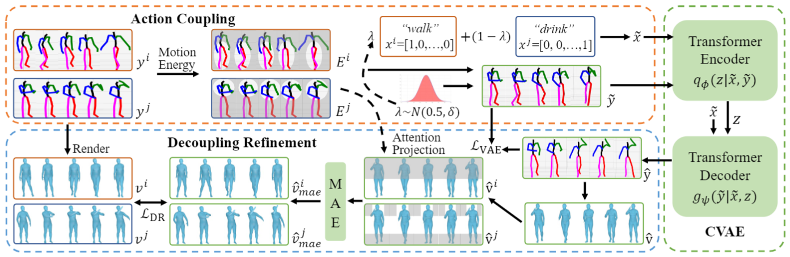

# Language-free-Compositional-Action-Generation-via-Decoupling-Refinement

This repository contains PyTorch implementation for the paper __Language-free-Compositional-Action-Generation-via-Decoupling-Refinement__ [[arXiv]](https://arxiv.org/pdf/2307.03538.pdf)

We introduce a novel framework to generate compositional actions without language auxiliaries. Our approach consists of three components: Action Coupling, Conditional Action Generation, and Decoupling Refinement. 

## License
This code is distributed under an [MIT LICENSE](LICENSE).

